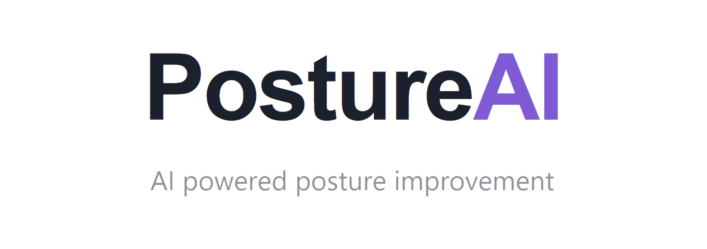

<br />
<p align="center">
  <a href="http://postureai.tech/">
    
  </a>

  <div align="center">

[![Contributors][contributors-shield]][contributors-url]
[![Stargazers][stars-shield]][stars-url]
[![Issues][issues-shield]][issues-url]
[![MIT License][license-shield]][license-url]

</div>

  <h2 align="center">PostureAI</h2>

  <p align="center">
    PostureAI analyzes your posture & notifies you in real-time!
    <br />
    Received 1st Place in Best Use of Google Cloud at UofTHacks VIII
    <br />
    <a href="https://postureai.tech">View Demo</a>
  </p>
</p>

<!-- TABLE OF CONTENTS -->
<details open="open">
  <summary>Table of Contents</summary>
  <ol>
    <li>
      <a href="#about-the-project">About The Project</a>
      <ul>
        <li><a href="#built-with">Built With</a></li>
      </ul>
    </li>
    <li>
      <a href="#getting-started">Getting Started</a>
      <ul>
        <li><a href="#prerequisites">Prerequisites</a></li>
        <li><a href="#installation">Installation</a></li>
      </ul>
    </li>
    <li><a href="#usage">Usage</a></li>
    <li><a href="#license">License</a></li>
    <li><a href="#contact">Contact</a></li>
  </ol>
</details>

<!-- ABOUT THE PROJECT -->

## About The Project

With work-from-home becoming a way of life due to COVID-19, it can be easy to slump over while working resulting in back pain & long-term health effects.
PostureAI detects your posture on a regular intervals and helps correct it!

### Built With

This project is comprised of two main parts: the face-calc library for posture analysis and the React frontend application.

The frontend is a static site, built with React and deployed using Firebase.

Face-calc:

- face-api

React:

- Chakra-UI
- react-webcam

<!-- GETTING STARTED -->

## Getting Started

This is an example of how you may give instructions on setting up your project locally.
To get a local copy up and running follow these simple example steps.

### Prerequisites

- Node (frontend)
- yarn

### Installation

```sh
yarn
yarn start
```

Happy hacking!

<!-- USAGE EXAMPLES -->

## Usage

1. Enable webcam permissions
2. Get into an ergonomic position
3. Set the timer
4. Click calibrate!

PostureAI will notify you if your posture changes negatively, allowing you to correct it quickly.

<!-- LICENSE -->

## License

Distributed under the MIT License. See `LICENSE` for more information.

<!-- CONTACT -->

## Contact

[Shahmeer Shahid](https://www.linkedin.com/in/shahmeer-shahid/) - shahmeer800@gmail.com

[Lazar Lolic](https://www.linkedin.com/in/lazar-lolic-207779184/) - lazarlolic12@gmail.com

[Michael Phung](https://github.com/imphungky) - michael.phung@mail.utoronto.ca

[Jarrod Servilla](https://www.linkedin.com/in/jarrod-servilla/) - jarrod.servilla@gmail.com

[contributors-shield]: https://img.shields.io/github/contributors/jcserv/PostureAI
[contributors-url]: https://github.com/jcserv/PostureAI/graphs/contributors
[stars-shield]: https://img.shields.io/github/stars/jcserv/PostureAI
[stars-url]: https://github.com/jcserv/PostureAI/stargazers
[issues-shield]: https://img.shields.io/github/issues/jcserv/PostureAI
[issues-url]: https://github.com/jcserv/PostureAI/issues
[license-shield]: https://img.shields.io/github/license/jcserv/PostureAI
[license-url]: https://github.com/jcserv/PostureAI/blob/main/LICENSE
